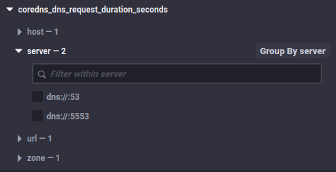
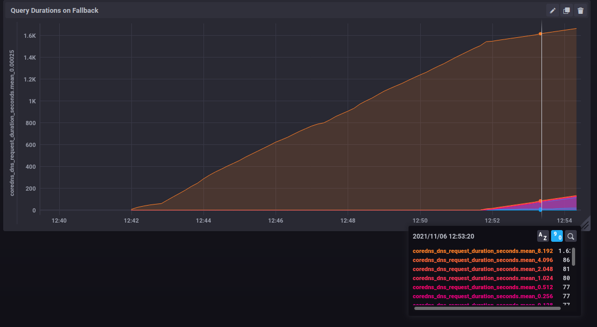

## Example setup - Monitoring CoreDNS

The reason I created this add-on is I wanted to be able to chart out the performance difference between hassio-DNS's default habit of using Cloudflare and not (using my override plugin made things feel faster, wanted to prove that was the case).

So, using my [core-dns-override](https://github.com/bentasker/HomeAssistantAddons/tree/master/core-dns-override) plugin, I enabled the Prometheus endpoint in CoreDNS:

    .:53 {
        log {
            class error
        }
        errors
        loop

        hosts /config/hosts {
            fallthrough
        }
        template ANY AAAA local.hass.io hassio {
            rcode NOERROR
        }
        mdns
        forward . dns://192.168.1.253 dns://127.0.0.1:5553 {
            except local.hass.io
            policy sequential
            health_check 1m
        }
        fallback REFUSED,SERVFAIL,NXDOMAIN . dns://127.0.0.1:5553
        prometheus 0.0.0.0:9153
        cache 600
    }

    .:5553 {
        log {
            class error
        }
        errors

        forward . tls://1.1.1.1 tls://1.0.0.1  {
            tls_servername cloudflare-dns.com
            except local.hass.io
            health_check 5m
        }
        prometheus 0.0.0.0:9153
        cache 600
    }
    
Then, I created my telegraf configuration in `/config/telegraf.conf`

    [agent]
    interval = "10s"
    round_interval = true
    metric_batch_size = 300
    metric_buffer_limit = 5000
    collection_jitter = "0s"
    flush_interval = "20s"
    flush_jitter = "0s"
    precision = ""
    debug = false
    quiet = false
    logfile = ""
    hostname = "home-assistant"
    omit_hostname = false

    [[inputs.diskio]]
    [[inputs.mem]]
    [[inputs.net]]
    [[inputs.swap]]
    [[inputs.system]]
    [[inputs.cpu]]
    ## Whether to report per-cpu stats or not
    percpu = true
    ## Whether to report total system cpu stats or not
    totalcpu = true
    ## If true, collect raw CPU time metrics.
    collect_cpu_time = false
    ## If true, compute and report the sum of all non-idle CPU states.
    report_active = false

    
    [[inputs.prometheus]]
    ## An array of urls to scrape metrics from.
    urls = ["http://hassio_dns:9153/metrics"]  

    [[outputs.influxdb]]
    urls = ["http://192.168.3.84:8086"]
    database = "home_assistant_performance"

Within a few seconds, data started appearing in InfluxDB, the measurement we're most interested in is `coredns_dns_request_duration_seconds` - there's a tag for each of the server blocks:

We can then trivially graph out how many responses the fallback is sending a second

(this is with a forced failure to ensure it's used)

We can also graph out reponse times for that fallback, and see that it is *very* slow to fail queries (Cloudflare is blocked at the firewall in this graph)

Although artificially blocked here, that clearly translates to very slow response times if there are issues between HomeAssistant and Cloudflare - essentially blocking execution of automations etc.

