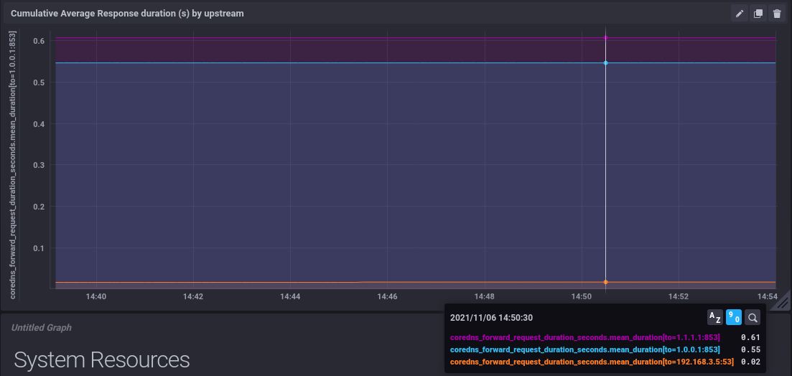
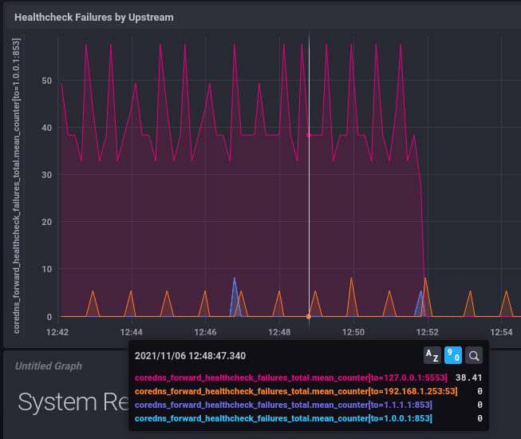
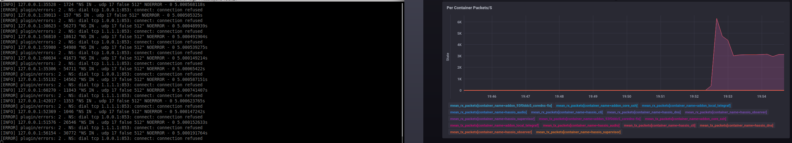
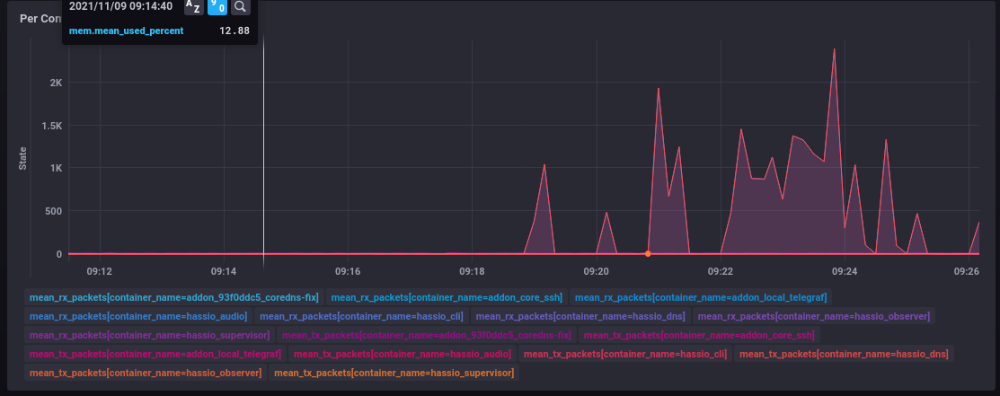
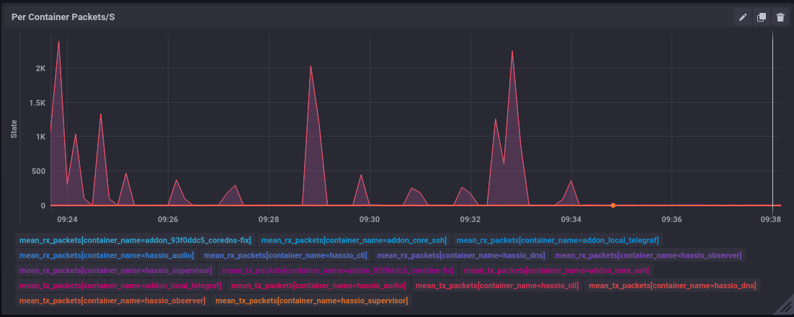

## Example setup - Monitoring CoreDNS

Note: this has been reported upstream [plugin-dns#64](https://github.com/home-assistant/plugin-dns/issues/64)

The reason I created this add-on is I wanted to be able to chart out the performance difference between hassio-DNS's default habit of using Cloudflare and not (using my override plugin made things feel faster, wanted to prove that was the case).

So, using my [core-dns-override](https://github.com/bentasker/HomeAssistantAddons/tree/master/core-dns-override) plugin, I enabled the Prometheus endpoint in CoreDNS:

    .:53 {
        log {
            class error
        }
        errors
        loop

        hosts /config/hosts {
            fallthrough
        }
        template ANY AAAA local.hass.io hassio {
            rcode NOERROR
        }
        mdns
        forward . dns://192.168.1.253 dns://127.0.0.1:5553 {
            except local.hass.io
            policy sequential
            health_check 1m
        }
        fallback REFUSED,SERVFAIL,NXDOMAIN . dns://127.0.0.1:5553
        prometheus 0.0.0.0:9153
        cache 600
    }

    .:5553 {
        log {
            class error
        }
        errors

        forward . tls://1.1.1.1 tls://1.0.0.1  {
            tls_servername cloudflare-dns.com
            except local.hass.io
            health_check 5m
        }
        prometheus 0.0.0.0:9153
        cache 600
    }

    
### Telegraf config

Then, I created my telegraf configuration in `/config/telegraf.conf`

    [agent]
    interval = "10s"
    round_interval = true
    metric_batch_size = 300
    metric_buffer_limit = 5000
    collection_jitter = "0s"
    flush_interval = "20s"
    flush_jitter = "0s"
    precision = ""
    debug = false
    quiet = false
    logfile = ""
    hostname = "home-assistant"
    omit_hostname = false

    [[inputs.diskio]]
    [[inputs.mem]]
    [[inputs.net]]
    [[inputs.swap]]
    [[inputs.system]]
    [[inputs.cpu]]
    ## Whether to report per-cpu stats or not
    percpu = true
    ## Whether to report total system cpu stats or not
    totalcpu = true
    ## If true, collect raw CPU time metrics.
    collect_cpu_time = false
    ## If true, compute and report the sum of all non-idle CPU states.
    report_active = false

    
    [[inputs.prometheus]]
    ## An array of urls to scrape metrics from.
    urls = ["http://hassio_dns:9153/metrics"]  

    [[inputs.docker]]
    endpoint = "unix:///var/run/docker.sock"
    timeout = "5s"
        
    [[outputs.influxdb]]
    urls = ["http://192.168.3.84:8086"]
    database = "home_assistant_performance"

Within a few seconds, data started appearing in InfluxDB, the measurement we're most interested in is `coredns_dns_request_duration_seconds` - there's a tag for each of the server blocks:


We can then trivially graph out how many responses the fallback is sending a second


(this is with a forced failure to ensure it's used)

We can also graph out reponse times for that fallback, and see that it is *very* slow to fail queries (Cloudflare is blocked at the firewall in this graph)


Although artificially blocked here, that clearly translates to very slow response times if there are issues between HomeAssistant and Cloudflare - essentially blocking execution of automations etc.

With Cloudflare unblocked, we can see that it's still significantly slower than local



CF's responses take around 500ms longer than the local DNS server - that's an additional half second lag when running scripts/automations which require an external name to be (re)resolved.

A ping to `1.1.1.1` shows a RTT of 10 - 13ms, so the additional latency is probably attributable to the overheads of DoT. Although the user's observed latency may also be increased by the inter-coreDNS communication (there's a UDP communication between the server block on `:53` and the one on `:5553`), it's not included in the graphed statistic.

Whatever the cause, where queries are passed to Cloudflare erroneously, latency is *25x* higher, even before the impact of passing local names to Cloudflare is taken into account.

### Impact of Healthchecks

Looking at healthcheck failure rates, we can see how the coredns configuration inadvertantly contributes to the packet storms some users have complained of



We can see lots and lots of failures against `127.0.0.1:5553`, despite it not being supposed to be used as an actual upstream.

The reason is that the default HomeAssistant config contains this:

```
        forward . dns://192.168.1.253 dns://127.0.0.1:5553 {
            except local.hass.io
            policy sequential
            health_check 1m
        }
```

It's therefore considered an upstream and will receive a healthcheck every 1 minute. This _clearly_ wasn't desired by the devs because they set the fallback healthcheck interval at 5m:

```
        forward . tls://1.1.1.1 tls://1.0.0.1  {
            tls_servername cloudflare-dns.com
            except local.hass.io
            health_check 5m
        }
```

The result is that when conneectivity to Cloudflare fails, an unexpectedly large number of healthchecks fail.

----

### Impact of `fallback` section

This is actually worse than first thought.

With the firewall rejecting connections to Cloudflare (i.e. it will actively send a `RST` back), we see a spike to 6000pps from the DNS container, with the rate stabilising down to 3000 junk packets/sec

This is because, at startup, `coredns` sends a query for `.` to the fallback.

If Cloudflare were reachable, this'd result in 2 packets on the network - query and response. However, when it isn't, we instead get this:



This only occurs when the `fallback` statement is present - the presence (or lack of) `127.0.0.1:5553` in the forward statement has no impact on the rate of the storm.

The `fallback` plugin uses the `proxy` plugin under the hood, and it appears that `proxy` will just cycle over it's upstreams trying to elicit a response until it reaches it's own timeout - see [Line 78 of proxy.go](https://github.com/coredns/proxy/blob/master/proxy.go#L78).

Technically the same behaviour occurs when the firewall is configured to drop rather than reject packets - it's just that the storm can't develop nearly as fast because of the time inherently required to hit timeouts (although some caution is needed - `coredns`'s `forward` plugin can dynamically adjust it's timeouts, so I assume `proxy` can too).

However, this behaviour can first arise *after* startup too - any time that `127.0.0.1:5553` is tried.

For example, if we simulate a local DNS server issue by blocking packets from HomeAssistant:

    root@PIHRP1:~# iptables -I INPUT -s 192.168.3.16 -j DROP

And then send a single query:

    ➜  ~ dig -p 53 @172.30.32.3 testquery.bentasker.co.uk 

This causes `coredns` to move onto the next host in it's `forward` statement, triggering intermittent storms



The initial "recoveries" there are exactly 30s long - that's `coredns`'s retry cycling back to the local host and needing to wait for it to timeout before moving on. But then `coredns` dynamic timeouts appear to come into play, and the "recovery" gets shorter and shorter

At this point, the querying client has long-since received a `SERVFAIL` but `coredns` continues to spam the network.

It's assume that we can make this worse too - if the local DNS server's process crashed we'd see resets instead.

    bash-5.1# pkill coredns # stop it's retry attempts
    root@PIHRP1:~# iptables -I INPUT -s 192.168.3.16 -j REJECT
    ➜  ~ dig -p 53 @172.30.32.3 testquery2.bentasker.co.uk
    
However, this doesn't change the behaviour in the graphs. This is _presumably_ because the local server is being contacted using `UDP`, so will receive an ICMP unreachable from the firewall - it appears this doesn't trigger a retry. 

This suggests that the fault (such as it is) lies in `coredns`'s handling of TCP connections, so switching the fallback to use UDP rather than DoT may also resolve the behaviour.

Quick config rewrite then:

    forward . dns://1.1.1.1 dns://1.0.0.1  {
        tls_servername cloudflare-dns.com
        except local.hass.io
        health_check 5m
    }

Quick test to verify it's working, and then blocked in firewall.

    bash-5.1# pkill coredns

No storm, also ran a query via `5553` to verify that the query fails



So, a "fix" of switching the fallback to UDP would also be valid

----

## Repro

OK, so pulling this altogether, this is how to Repro and verify the above.

### Metrics collection

Optional, you could also just run a packet capture if you don't want graphs

- Stand up an InfluxDB instance (or sign up for a free account at https://cloud2.influxdata.com)
- Create a telegraf config in `/config/telegraf.conf` (Config I used is [here](https://github.com/bentasker/HomeAssistantAddons/tree/master/telegraf))
- Install and start my [Telegraf addon](https://github.com/bentasker/HomeAssistantAddons/tree/master/telegraf)
- Exec into `hassio_dns` and edit `/etc/corefile` to add `prometheus 0.0.0.0:9153` to each of the server blocks
- Run `pkill coredns` on `hassio_dns` to force a config reload
- Stats should start appearing in InfluxDB (If you're using Chronograf, you can import [this](https://github.com/home-assistant/plugin-dns/files/7503425/HomeAssistant.DNS.json.gz) dashboard as a starting point - you'll prob need to edit the DB name if you're writing into a different one than me)


### Repro

On your network firewall, add two rules

- Dest: `1.0.0.1` Proto: any, dport: `853` `REJECT`
- Dest: `1.1.1.1` Proto: any, dport: `853` `REJECT`

Exec into `hassio_dns` and 

- `cp /etc/corefile /root/`
- `pkill coredns` to trigger a restart

You should see thousands of packets hit the network. If you're using some other metrics+graphing solution, be aware that you may not see them in graphs for `eth0` (or whatever your main interface is) because the container uses an aliased interface.

Now exec into `hassio_dns` and edit `/etc/corefile` to remove the `fallback` line. Run `pkill coredns` to force a restart - you should not see significant packet rates on the network after this.

Restore the original config `cp /root/corefile /etc/` and then edit it to make the upstream use plain DNS

    forward . dns://1.1.1.1 dns://1.0.0.1  {
        tls_servername cloudflare-dns.com
        except local.hass.io
        health_check 5m
    }
    
On your firewall, add two more rules

- Dest: `1.0.0.1` Proto: any, dport: `53` `REJECT`
- Dest: `1.1.1.1` Proto: any, dport: `53` `REJECT`

`pkill coredns` should not elicit a packet storm.

